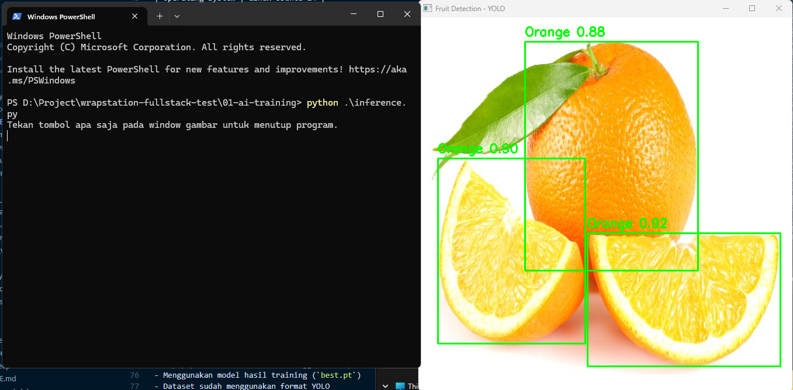

# AI Training - Fruit Object Detection

Project ini merupakan implementasi Object Detection menggunakan YOLO (Ultralytics) untuk mendeteksi dan mengklasifikasikan berbagai jenis buah berdasarkan dataset yang telah disediakan oleh Wrap Station Group technical test.



## Features

- Training model menggunakan YOLOv11
- Object Detection pada gambar buah
- Menampilkan bounding box dan label kelas
- Popup preview hasil deteksi menggunakan OpenCV
- Menggunakan model hasil training (`best.pt`)
- Model hasil training (`best.pt`) berada di folder `runs/train/yolo11_fruits/weights/`


---

# Dataset

Dataset yang digunakan:

https://www.kaggle.com/datasets/kapturovalexander/fruits-by-yolo-fruits-detection

---

# Project Structure

```bash
01-ai-training/
│
├── dataset/
│   ├── test/
│   │   ├── images/
│   │   └── labels/
│   ├── train/
│   │   ├── images/
│   │   └── labels/
│   └── valid/
│       ├── images/
│       └── labels/
├── run/train/yolo11_fuits/weights/
│   └── best.pt
├── Fruits by YOLO.v1i.yolov8.zip
├── inference.py
├── train.ipynb
├── requirements.txt
└── README.md
```

## Setup Project

Masuk ke folder project:

```bash
cd 01-ai-training
```

Buat virtual environment:

```bash
python -m venv venv
```

Aktifkan virtual environment:

```bash
venv\Scripts\activate
```

Install dependencies:

```bash
pip install -r requirements.txt
```

Pastikan struktur file seperti ini:

```bash
01-ai-training/
│
├── dataset/
│   ├── test/
│   │   ├── images/
│   │   └── labels/
│   ├── train/
│   │   ├── images/
│   │   └── labels/
│   └── valid/
│       ├── images/
│       └── labels/
├── runs/train/yolo11_fuits/weights/
│   └── best.pt
├── Fruits by YOLO.v1i.yolov8.zip
├── inference.py
├── train.ipynb
├── requirements.txt
└── README.md
```

Jika struktur project belum seperti di atas, silakan download dataset terlebih dahulu melalui link berikut:

https://www.kaggle.com/datasets/kapturovalexander/fruits-by-yolo-fruits-detection atau
https://universe.roboflow.com/fruitsdetection/fruits-by-yolo/dataset/1 (Sudah ada anotasi untuk setiap object class)

Kemudian extract dataset ke dalam folder:

```bash
dataset/
```

## Run Inference

Pastikan file model tersedia di:

```bash
01-ai-training/
│
├── runs/train/yolo11_fuits/weights/
│   └── best.pt
```

Pastikan gambar test tersedia di:

```bash
01-ai-training/
│
├── dataset/
│   └── test
│       └── images
│           └── *.jpg
```

Jalankan script inference:

```bash
python inference.py
```

## Run Training

Jalankan notebook training:

```bash
jupyter notebook train.ipynb
```

Atau jika menggunakan VS Code, buka file:

```bash
train.ipynb
```

Lalu jalankan cell training satu per satu.

