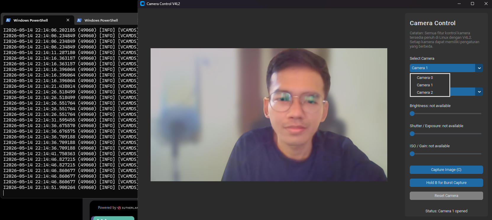
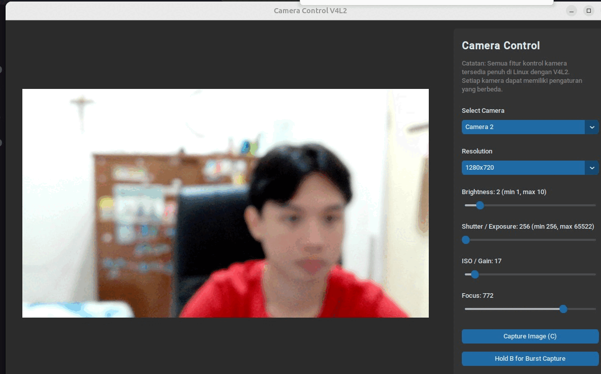

# IoT & Embedded Systems - Camera Control with OpenCV and V4L2

Project ini merupakan implementasi aplikasi Camera Control sederhana menggunakan OpenCV dan Video4Linux (V4L2) untuk mengakses, menampilkan, dan mengontrol kamera/webcam sesuai technical test dari Wrap Station Group.

Aplikasi dibangun menggunakan Python dan CustomTkinter sebagai GUI framework, dengan dukungan kontrol kamera menggunakan V4L2 (`v4l2-ctl`) pada Linux.



> Dijalankan pada windows.



> Dijalankan pada linux.

## Features

- Live Preview kamera secara realtime menggunakan OpenCV
- Select Camera / Multiple Camera Support
- Capture Image menggunakan tombol keyboard (`C`)
- Burst Capture menggunakan tombol keyboard (`B`)
- GUI menggunakan CustomTkinter
- Support pengaturan resolusi kamera
- Menyimpan hasil capture otomatis ke folder output
- Cross-platform development:
  - Windows untuk development dan preview UI
  - Linux untuk akses penuh kontrol kamera menggunakan V4L2
- Dynamic Camera Control Detection pada Linux:
  - Membaca control asli kamera menggunakan `v4l2-ctl --list-ctrls`
  - Slider otomatis menyesuaikan nilai `min`, `max`, dan `value` dari kamera
  - Slider akan dikunci jika control tidak tersedia atau tidak aktif
  - Menampilkan keterangan `not available` jika setting tidak didukung kamera
- Auto Manual Control pada Linux:
  - Otomatis mengaktifkan manual exposure jika tersedia
  - Otomatis menonaktifkan continuous autofocus jika tersedia
  - Refresh ulang setting kamera saat user mengganti kamera
- Kontrol parameter kamera menggunakan V4L2 pada Linux:
  - Brightness
  - Shutter / Exposure
  - ISO / Gain
  - Focus
- Windows Mode:
  - Slider control kamera dinonaktifkan
  - Menampilkan keterangan bahwa control tidak tersedia di Windows

---

# Technologies

- Python
- OpenCV
- CustomTkinter
- Pillow
- Video4Linux (V4L2)

---

# Project Structure

```bash
02-iot-camera/
│
├── app/
│   ├── __init__.py
│   ├── main.py
│   ├── ui.py
│   ├── camera.py
│   ├── v4l2_control.py
│   ├── mock_v4l2_control.py
│   ├── config.py
│   └── utils.py
│
├── output/
│   ├── captures/
│   └── bursts/
│
├── requirements.txt
├── README.md
└── run.py
```

---

# Setup Project

Masuk ke folder project:

```bash
cd 02-iot-camera
```

Buat virtual environment:

```bash
python -m venv venv
```

> Sesuaikan command dengan environment masing-masing (`python` atau `python3`).

Pastikan Tkinter sudah terinstall. Jika belum, install dengan command berikut:

```bash
sudo apt-get install python3-tk
```
> Sesuaikan command dengan environment masing-masing (`python` atau `python3`).

Aktifkan virtual environment:

Linux:

```bash
source venv/bin/activate
```

Install dependencies:

```bash
pip install -r requirements.txt
```

---

# Linux Setup (V4L2)

Install V4L2 utilities:

```bash
sudo apt install v4l-utils
```

Cek daftar kamera:

```bash
v4l2-ctl --list-devices
```

Cek camera controls:

```bash
v4l2-ctl --list-ctrls
```

Cek resolusi kamera yang tersedia:

```bash
v4l2-ctl --list-formats-ext
```

---

# Run Application

Jalankan aplikasi:

```bash
python run.py
```

---

# Key Mapping

| Key | Function |
|---|---|
| C | Capture Image |
| B | Burst Capture |
| Q | Quit Application |

---

# Output Structure

Hasil single capture akan disimpan pada folder:

```bash
output/captures/
```

Hasil burst capture akan disimpan pada folder:

```bash
output/bursts/
```

---

# Camera Controls

Aplikasi mendukung kontrol kamera menggunakan V4L2 pada Linux:

- Brightness
- Exposure / Shutter Speed
- ISO / Gain

Aplikasi akan membaca capability kamera secara otomatis. Setiap kamera dapat memiliki daftar control, nilai minimum, nilai maksimum, dan status aktif yang berbeda-beda.

Jika sebuah control tidak tersedia atau sedang inactive, slider pada GUI akan otomatis dikunci dan menampilkan keterangan `not available`.

---

# Notes

- Development UI dilakukan menggunakan Windows.
- Kontrol hardware kamera menggunakan V4L2 dijalankan pada Linux.
- Disarankan menggunakan webcam asli atau webcam USB eksternal saat pengujian di Linux.

---

# Requirements

Isi file `requirements.txt`:

```txt
opencv-python
customtkinter
pillow
numpy
```